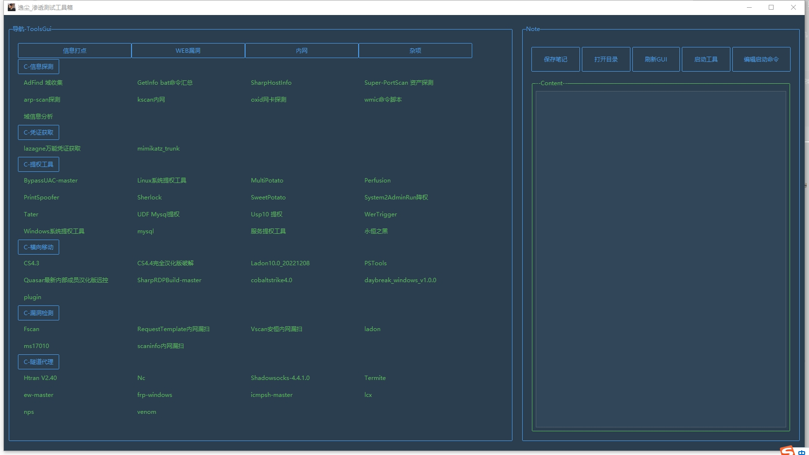

<h1 align="center" >GUI-tools</h1>

## 🏝 0x01 非原创

优化作者：Yi-Chen，基于原创上使用ttk进行界面优化，并非原创，个人自用版本工具箱，非盈利。

原创作者：tyB-or 

注释：tyB-or 绿盟大佬

作者工具定位：开源，高自由，可DIV的整理工具，使用简单，方便，适合渗透人员使用

具体使用，及后续版本优化，可关注作者

下载链接：https://github.com/tyB-or/FreeGui

语言：python3开发

功能：适用于整理文件夹，及个人工具

> 要是喜欢这个工具可以给原创作者支持一下，github点亮一颗星星!

## 🎸0x02 安装使用

1、所需库安装

```python
pip3 install -r requirements.txt
```

2、使用

```python
开启：python tools.py
一键启动：GUI启动.VBS
```

3、说明

```python
文件:config.py 			 配置文件。
文件：tools.py 			主配置文件
文件：run.bat  			带cmd框的启动方式
文件：GUI启动.vbs 		   一键启动方式，无cmd框
文件：logo.ico 		    图标可替换
文件：requirements.txt		需下载python第三方库
文件：README.md			工具说明
文件夹：tools			   文件夹，可内置个人文件，并设置路径
文件夹：imgs			   图片

另外说明：启动后会自动生产__pycache__文件，可删除
```

## 💡0x03 效果展示

逸尘优化后配置效果图：




📖0x04 配置文件
---

```python
;20230111
;bytyb-or
;python3.10;3.7有问题，建议使用3.10版本
;样式参考：https://ttkbootstrap.readthedocs.io/en/latest/zh/

;"""
;修改外观，样式
;配置文件分为app(全局)app-左（工具）app-右（笔记）3大区域
;"""

;===================================工具相关参数=====================================

[app]
title=逸尘_渗透测试工具箱
;工具的标题
theme=superhero
;工具主题样式，参考：litera，darkly，lumen，sandstone，yeti，united，morph，journal，superhero，solar，simplex，cerculean

size_w=1650
;工具大小--宽
size_h=900
;工具大小--高

average = 5
;工具等分为多少份
tool_aver = 3
;工具框架占比3份，说明，工具框架的宽度占比总宽的3/5
note_aver = 2
;工具框架占比3份，占比总宽的2/5


txt_mark=00.txt
;笔记标识，每个工具的txt备忘。不建议修改。00可以保证排序比较前。

;============================tool框架相关参数-左边====================================

[tool]
title=导航-ToolsGui
;工具框架的标题
theme=PRIMARY
;Labelframe控件bootstyle，影响边框颜色参考：default,primary,success,info,warning,danger
scrolled=round
;滚动条样式：圆【加-round】和方形，方形参考：default,primary,secondary,success,info,warning,danger,light,dark，圆角举例：danger-round，默认圆角就是round

toolColumn=4
;多少列，工具框架中多少列，可修改
columnWidth=30
;列宽--自己设置，分辨率会影响，所以需要自己调试

;注意：这里的后面的标识也是目录识别的特征，可以自己设置，根据不同的标识区分不同类别，实现功能菜单的切换
;同步toolColumn参数，如果设置7列，列表中必须7个元素，如果分类不多，就用["预留X","自己设定标志识别符"]占位。
funList=[["信息打点","A-"],["WEB漏洞","B-"],["内网","C-"],["杂项","D-"],["预留2","自己设定标志识别符"],["预留3","自己设定标志识别符"]]

funBtnBootstyle=outline-toolbutton
;工具框架中的菜单切换按钮的样式，Bootstyle：default,primary,secondary,success,info,warning,danger,light,dark
typeBtnBootstyle=outline-toolbutton
;工具类别按钮的样式,Bootstyle：Bootstyle：default,primary,secondary,success,info,warning,danger,light,dark
toolBtnBootstyle=success-linkdanger-link
;工具按钮的样式，Bootstyle：success-linkdanger-link（参考上面的加-link）


;==================================note框架相关参数-右边===============================

[note]
title=Note
;笔记框架的标题
theme=PRIMARY
;笔记框架样式，Labelframe控件bootstyle，影响边框颜色参考：default,primary,success,info,warning,danger
theme_up = default
;笔记框架功能框架样式，Labelframe控件bootstyle，影响边框颜色参考：default,primary,success,info,warning,danger

funBtnBootstyle=outline-toolbutton
;笔记框架中上面的按钮的样式，Bootstyle：Bootstyle：default,primary,secondary,success,info,warning,danger,light,dark

startComBtnBootstyle_open=info
;启动命令修改按钮样式的单独设置，参考Bootstyle
startComBtnBootstyle_save=danger
;启动命令按钮样式的单独设置，参考Bootstyle

styleBtnBootstyle_open=info
;样式修改按钮样式的单独设置，参考Bootstyle
styleBtnBootstyle_save=danger
;样式保存按钮样式的单独设置，参考Bootstyle

txt_title=--Content--
;txt笔记的文本提示信息，LabelFrame，后续会随点击的工具不同，变成对应的路径信息

noteFrameDownStyle=success
;笔记框架文本框架样式，Style  笔记框架中分上下，上-功能，下-txt笔记，
scrolledTextBootstyle=success-round
;txt笔记的滚动条样式，;滚动条样式：圆【加-round】和方形，方形参考：Bootstyle：default,primary,secondary,success,info,warning,danger,light,dark，圆角举例：danger-round，默认圆角就是round
```

💻 0x05 优化版本更新预告
---

## 下载链接：https://github.com/tyB-or/FreeGui

